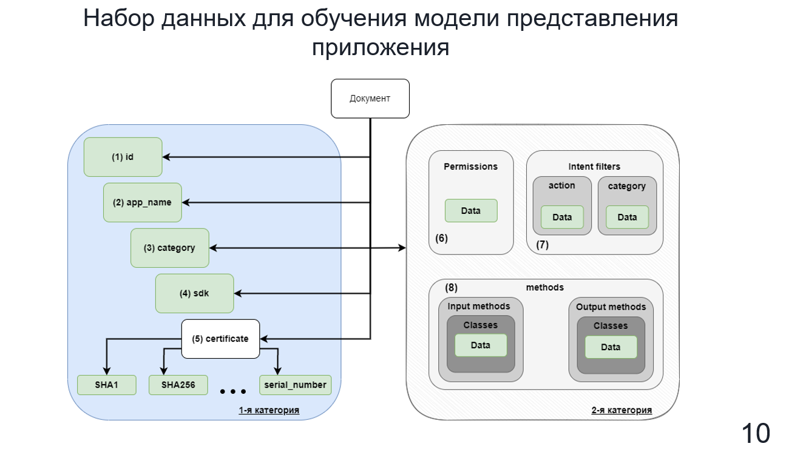
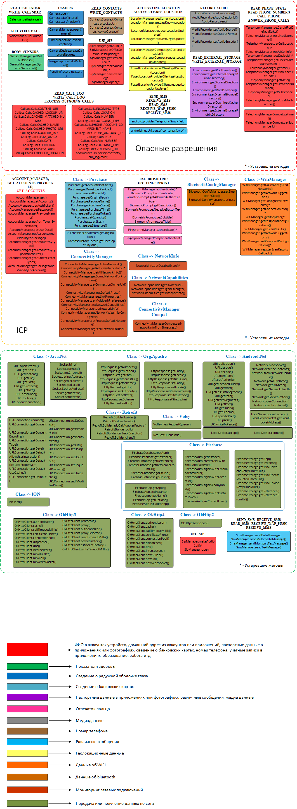
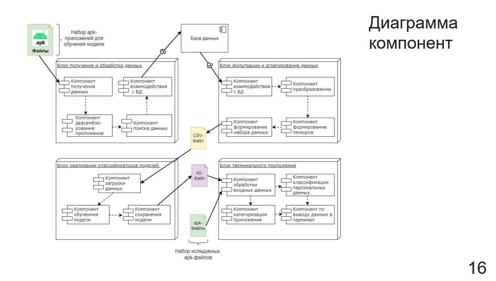
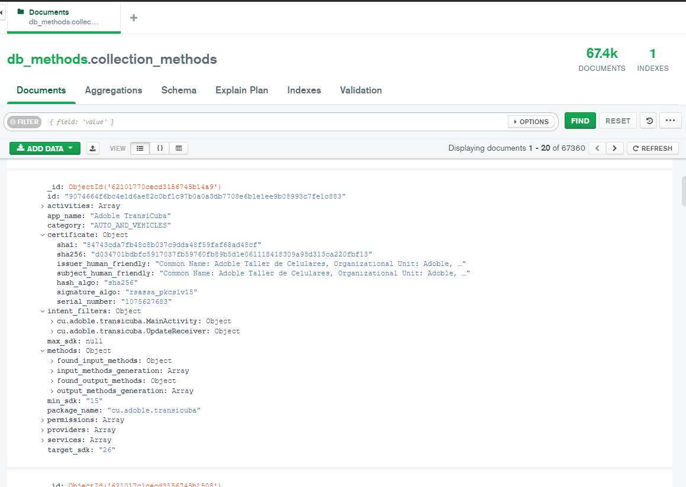

# Разработка системы идентификации каналов утечки персональных данных в мобильных приложениях на основе интеллектуальных технологий
С целью приведения автоматизированного дизасемблирования исходного кода smali используется программное средство Androguard, позволяющий преобразовать dex файлы в smali, 
Smali или baksmali — это ассемблер и дизассемблер для формата dex, используемого dalvik, реализацией Java VM для Android. Снизу представлены два одинаковых объекта, записанные в форме Smali и Java.
С помощью  библиотеки Androguard происходит поиск методов содержащих конфиденциально и потенциально конфиденциальные данные, а также методы для взаимодействия с удаленными ресурсами. На данном слайде представлена только часть методов, сформированных в наборе данных. Данные методы являются наиболее опасными связанные компрометации данных, также хочу отметить, что для использования этих методов, необходимо указывать разрешения в манифест файле. Для формирования набора данных учитывалось 314 метода  

Для описания особенностей физического представления системы используется диаграмма компонентов. Диаграмма компонент разработанного комплекса состоит из 4 блоков: получения и обработки данных, фильтрация и агрегирование данных, реализации классификаторов моделей, терминального приложения, обратите внимание что каждый блок передает различную информацию при помощи файлов, либо базы данных.

